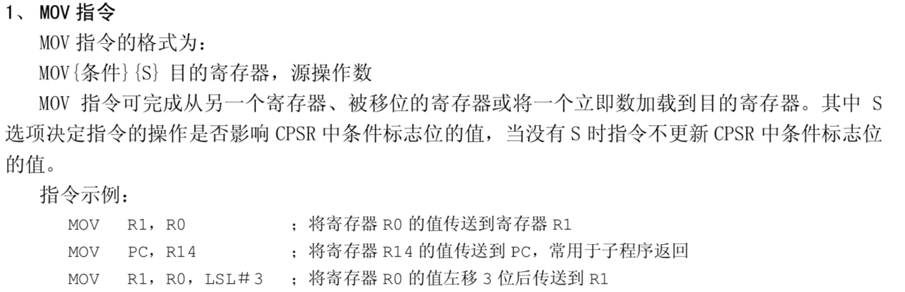
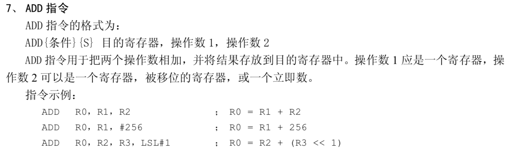
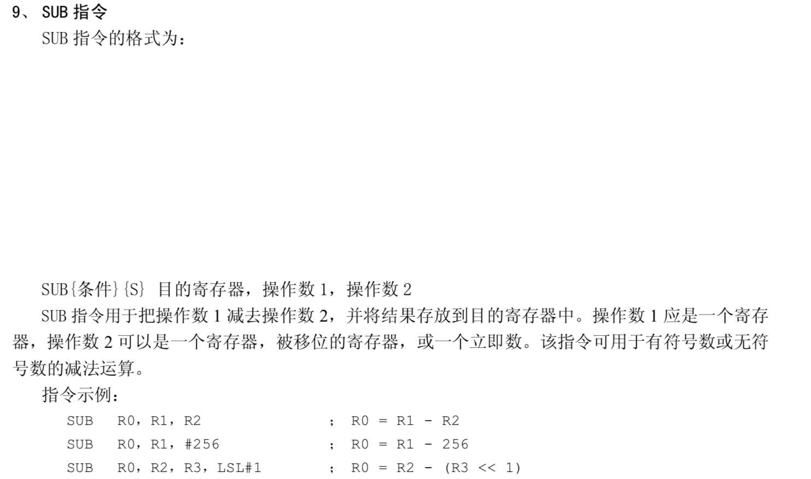
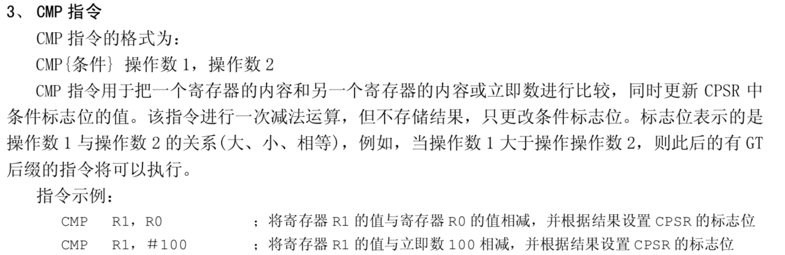
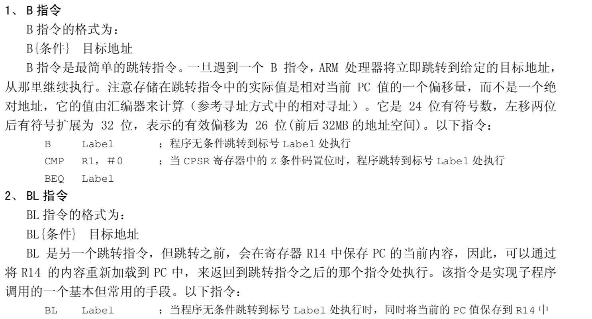

## ARM64汇编整理

### 寄存器
- 在xcode中下断点，进入命令模式，输入 **register read** 可以查看所有的寄存器，如下所示
- si 执行下一条指令
- ni 跳过函数执行下一条指令
- c 直接执行到下一个断点
- po &a :打印a的地址
- x &a ： 查看从a的地址开始的一段内存
```
General Purpose Registers:
        x0 = 0x00000001000e8040
        x1 = 0x0000000000000000
        x2 = 0x000000000000000d
        x3 = 0x0000000000000000
        x4 = 0x000000016fdc38c8
        x5 = 0x0000000000000040
        x6 = 0x0000001e04000100
        x7 = 0x000000016fdc27a8
        x8 = 0x000000000000000a
        x9 = 0x0000000000000014
       x10 = 0x00000001000e8040
       x11 = 0x0000000000000237
       x12 = 0x0000000000000000
       x13 = 0x0000000000000002
       x14 = 0x0000000000000001
       x15 = 0x0000000000000005
       x16 = 0x0000000190ec5dec  libobjc.A.dylib`objc_autoreleasePoolPop
       x17 = 0x0000000000000006
       x18 = 0x0000000000000000
       x19 = 0x0000000000000000
       x20 = 0x0000000000000000
       x21 = 0x0000000000000000
       x22 = 0x0000000000000000
       x23 = 0x0000000000000000
       x24 = 0x0000000000000000
       x25 = 0x0000000000000000
       x26 = 0x0000000000000000
       x27 = 0x0000000000000000
       x28 = 0x000000016fdc3aa0
        fp = 0x000000016fdc3a70
        lr = 0x0000000100040630  ARMTest`main + 36 at main.m:23
        sp = 0x000000016fdc3a30
        pc = 0x000000010004063c  ARMTest`main + 48 at main.m:26
      cpsr = 0x60000000
```
- 总结 
0. 通用寄存器
  -x0~x28 是64位的通用寄存器，每个寄存器占用8个字节
  -w0~w28 是32位的通用寄存器，每个寄存器占用4个字节，属于x0~x28的低32位
1. x0~x28称为通用寄存器
2. x0~x7通常拿来存放函数的参数，更多的参数使用堆栈来传递
3. x0通常用来存放函数的返回值
4. 堆栈指针寄存器（sp和fp）
	- fp（frame pointer），其实就是x29，也成为栈底指针寄存器
	- sp（stack pointer），也成为栈顶指针寄存器
5. 链接寄存器：lr
	- lr（link register），其实就是x30，存储函数的返回地址
  - 当程序调用bl指令（函数调用）的时候，会把下一条指令的地址存储到lr寄存器
6. 程序计数器：pc
	- pc（program counter）：记录cpu当前执行的是哪一条指令
	- 存储当前cpu正在执行的指令的地址，类似x86汇编中的ip寄存器
7. 程序状态寄存器：cpsr
	- cpsr（current program status register）
	- spsr （saved program status register），异常状态下使用

### 指令
- 编写汇编代码：在xcode中创建对应的.h和.s文件,在.h 中编写函数声明，在.s中写汇编
```
// .h文件
#ifndef arm_h
#define arm_h

void test();

#endif /* arm_h */

// .s文件

;表明代码段的意思
.text

;设置全局的函数，可供外部调用
.global _test

;函数实现
_test:
mov x1, #0x1
mov x3, x1
ret

```

1. mov

- mov 目的寄存器, 源操作数
- mov x1, #0x12

2. add

```
;_add函数的实现
_add:
;函数的参数会被寄存器读取，x0作为函数的返回值返回，
add x0, x0, x1
ret
```
3. sub

```
;_sub函数的实现
_sub:
sub x0,x0,x1
ret
```

4. cmp

```
;test函数实现,
_test:
; cmp指令
mov x0, #0x3
mov x1, #0x2
; x0-x1的结果，会影响cpsr寄存器中的某一位
cmp x0, x1
ret
```
5. b

- 跳转指令，类似8086的jump指令，类似c语言的goto
```
;_testCMP的函数实现测试b指令，一下函数执行的时候直接跳转到mycode的位置，所以不会执行 mov x0, #0x4
_testCMP:
b mycode
mov x0, #0x4
mycode:
mov x1, #0x6
ret

// xcode 执行的断点为，可以看出 b 指令后面跟的是一个地址，也就是mycode标志位的所在，将直接跳到这个位置执行代码
->  0x100094708 <+0>: b      0x100094710               ; mycode
```

- 可以带条件跳转，一般跟cmp配合使用
```
;_testCMP的函数实现带条件的跳转
_testCMP:
mov x0, #0x1
mov x1, #0x3
; x0-x1的结果影响cpsr寄存器中的标志位
cmp x0, x1
;从cpsr寄存器中取出响应的位，看看是否符合条件
;字面意思是 是否相等
beq mycode
mov x0, #0x4
mycode:
mov x1, #0x6
ret
```

6. bl 
- 带返回的跳转，类似函数的调用，调用完函数还会回到调用函数的位置

#### 内存操作的指令
- load 从内存中读取指令
1. ldr 
	- ldr x0, [地址] // 从地址开始取64位装到x0寄存器中（因为x0是64位）
	- ldr x0, [x1] //把寄存器x1中的存储的地址放到x0中

2. ldur
 	0x1000fc660 <+192>: ldur   w1, [x29, #-0x8]
    0x1000fc664 <+196>: ldur   x30, [x29, #-0x10]
    0x1000fc668 <+200>: ldr    x0, [x0]
    0x1000fc66c <+204>: ldr    x8, [x8]
3. ldp

- store 往内存中写入数据
1. str
2. stur
3. stp
4. 零寄存器，里面存储的都是0
	- wzr（32bit，word zero register）
	- xzr (64bit）


  ### 寄存器


