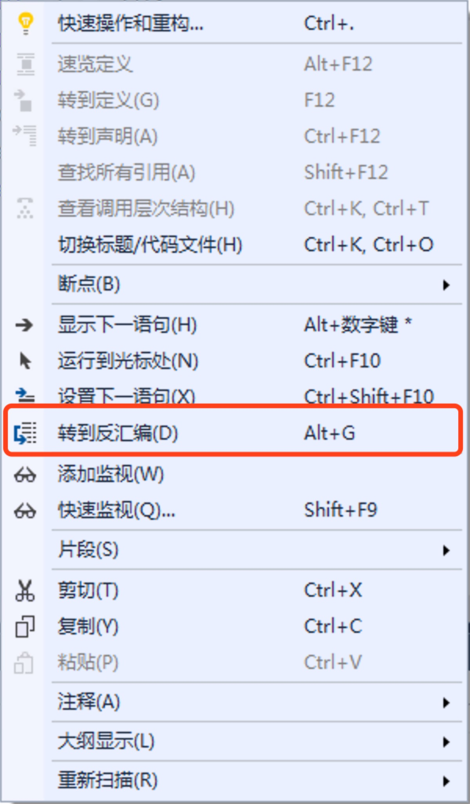
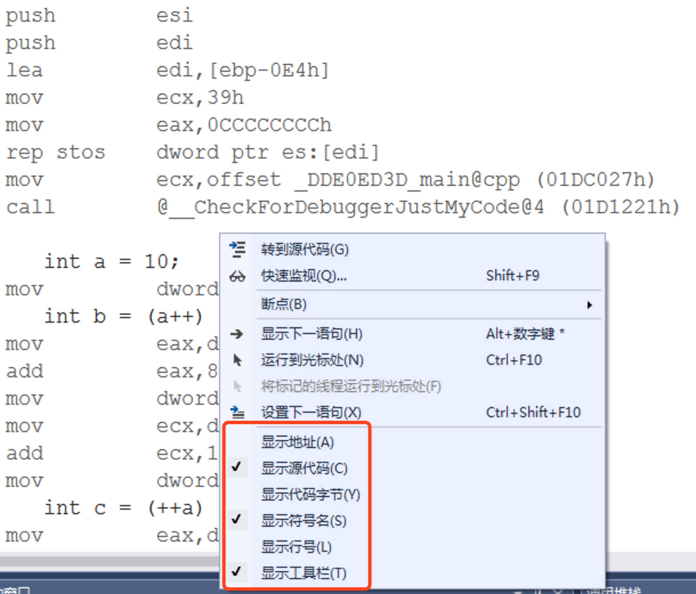
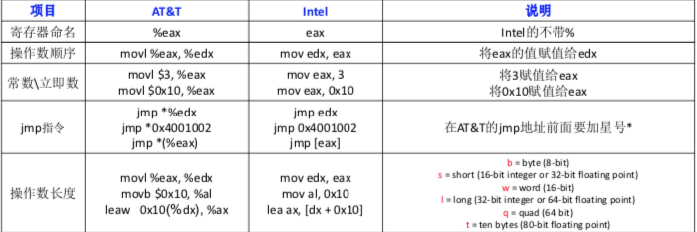
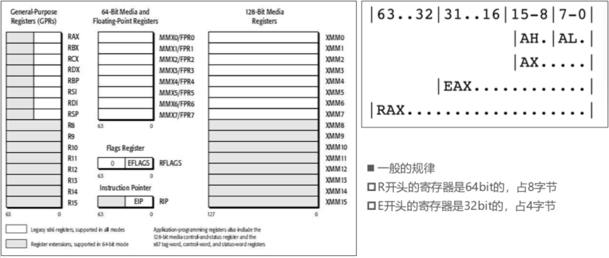
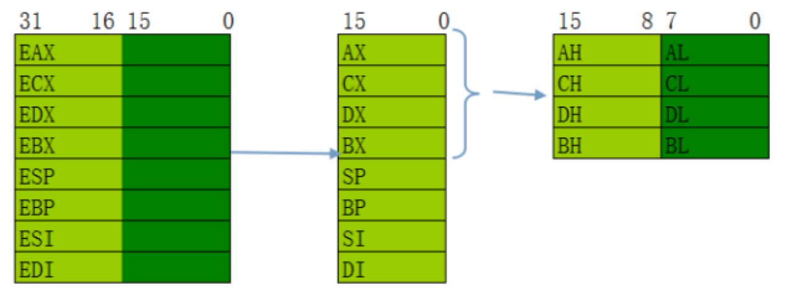
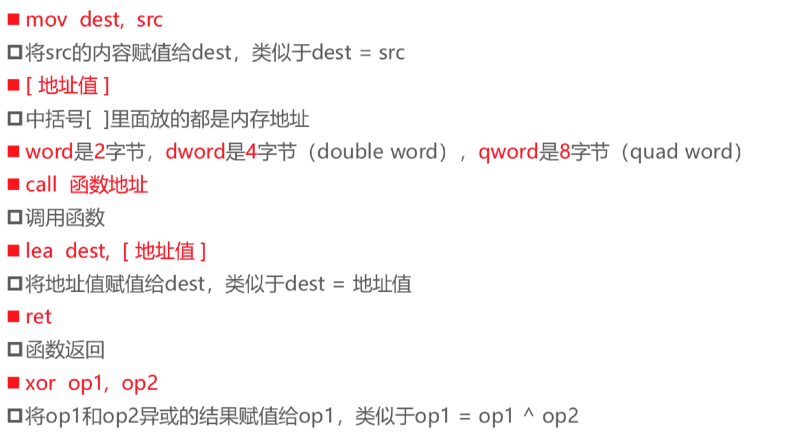
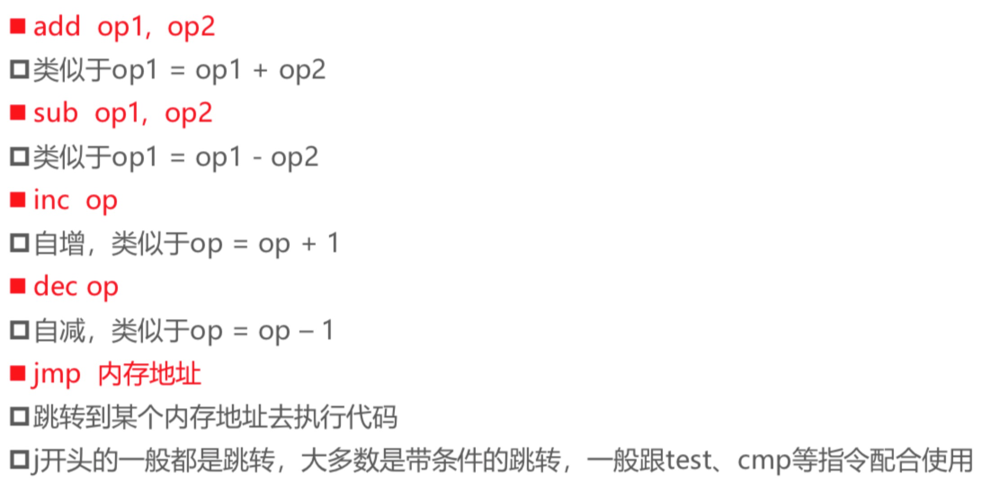

## x86 汇编整理

### 环境 
1. 软件: Microsoft Visual Studio 2017
2. 建立c++项目，在代码位置打上断点 （快捷键：F9），F5运行调试，进入断点后，右键选择->“转到反汇编”

3. 进入汇编页面，可调整汇编代码的显示样式

### 汇编语言介绍
- 汇编语言的种类
1. 8086汇编（16bit）
2. x86汇编（32bit）
3. x64汇编 (64bit)
4. ARM汇编（嵌入式、移动开发）
5.……

- x64汇编根据编译器不同，有两种书写格式
1. intel
2. AT&T

- intel 和 AT&T 的比较

### 汇编语言需要掌握的知识
1. 寄存器
2. 指令
3. 堆栈

- x64汇编寄存器

### x64汇编常用的汇编指令总结

